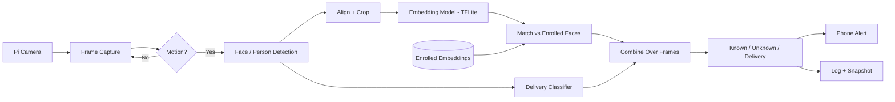

# Offline Smart Doorbell

EC-ENG 535/635 Course Project, Fall 2026, UMass Amherst
Instructor: Prof. Fatima Anwar
Team: Zoya Siddiqui, Vijay Rayavarapu, Athiniraj Karthigairaj

## Motivation

Most smart doorbells (Ring, Nest, etc.) send video to the cloud to recognize who is at the door. That means footage of your family and visitors is stored on someone else's servers, and the "smart" features stop working if the internet goes down. We want to build a doorbell that does all of the recognition locally on a Raspberry Pi, so nothing leaves the device.

Getting a face recognition model to run on a Pi is not that hard by itself. What we're more interested in is how well it works once you account for the Pi's limits (no GPU, limited memory, overheating under load) and for what a doorbell actually sees. People at a door are often at an angle, wearing hats or masks, or standing in bad lighting, and most of them are strangers the system has never seen. The system has to say "unknown" for those people instead of matching them to the closest household member. Mistaking a stranger for a family member is a much worse error than the reverse, so we care a lot about where we set the matching threshold.

We also want to see what happens when we shrink the models with quantization. Converting a model to INT8 makes it faster and smaller, but it can change the face embeddings slightly, which could mean the threshold we picked for the full model no longer works.

## What we want to find out

1. How much does INT8 quantization hurt recognition accuracy, especially for strangers being wrongly accepted? Is the drop the same in good and bad conditions, or worse in the hard cases (side angles, low light)?
2. Which part of the pipeline is slowest on the Pi, and can we keep it running without overheating by only running the models when there's motion?
3. How many photos per person do we need for enrollment, and how should we choose the threshold?

## Design goals

We set some initial targets, which we'll adjust after we get our first measurements:

- Everything runs offline, with no network calls needed for recognition
- A decision within about half a second of someone showing up
- At least 5 FPS while someone is in front of the camera
- Strangers wrongly recognized as household members less than 1% of the time
- Household members correctly recognized at least 90% of the time
- All models together under 20 MB
- Adding a new person should take 10 photos or fewer and no retraining

## How it will work

The camera runs continuously, but we only run the models when simple motion detection (comparing consecutive frames) sees something change. This saves compute and should help with overheating. When there's motion, we detect the face, crop and align it, and pass it through a small embedding model (something like MobileFaceNet). We compare the resulting embedding to the stored embeddings of each household member using cosine similarity. If the best match is above our threshold, it's that person; otherwise it's "unknown."

Rather than deciding from a single frame, we'll combine the results from a few frames in a row, since one blurry frame shouldn't decide the outcome.

For the delivery-person feature, we'll try fine-tuning a small classifier on images of delivery uniforms and packages. We aren't sure how much good training data we'll find for this, so we're treating it as a stretch goal.

## Testing plan

We'll use LFW as a standard benchmark so we can compare against published results. However, LFW is mostly clear frontal photos, so it will probably make our system look better than it really is. Our main test set will be photos and short clips we take ourselves at a door (with everyone's permission), covering daytime vs. night, different angles and distances, and things like hats, masks, and glasses. Friends who aren't enrolled will act as strangers.

We'll compare 2–3 embedding models at FP32, FP16, and INT8 and measure:

- accuracy for known people and how often strangers get accepted, broken down by condition
- latency for each stage of the pipeline, plus overall FPS
- memory use and model size
- CPU temperature over a longer run
- how much the embeddings themselves change after quantization

We'll also try different numbers of enrollment photos (1, 3, 5, 10) and see how much that matters.

## Deliverables

- The full pipeline running offline on the Pi
- A script to enroll new household members
- Known / unknown / delivery-person classification
- Phone notifications and a local log with snapshots
- Results and plots from the quantization and model comparison
- A live demo and final report

## Hardware and software

Hardware: Raspberry Pi running Raspberry Pi OS (Bookworm), Raspberry Pi Camera Module, a push button wired to the Pi's GPIO pins as the doorbell button, microSD card, power supply, and a heatsink or fan. Since overheating is part of what we're measuring, we'll note what cooling we use.

Software:
- Python 3
- Flask and Flask-SocketIO for a live web dashboard (python-socketio, python-engineio)
- face_recognition (dlib-based) as our baseline face recognition model
- OpenCV, NumPy, and Pillow for image capture and processing
- picamera2 for the Pi camera
- RPi.GPIO for the doorbell button
- eventlet and gunicorn for running the web server
- TensorFlow Lite for the lightweight models we quantize and compare against the baseline
- Google Colab for training and model conversion
- A Telegram bot for phone alerts
- scikit-learn and Matplotlib for analysis

## Known limitations and things we're watching for

- If quantization changes the embeddings too much, we'll recalibrate the threshold for each version or fall back to FP16.
- If the Pi overheats and slows down, we'll report numbers both with and without throttling.
- Night and backlit conditions will probably be the weakest. We may try contrast enhancement (CLAHE) on the input.
- The system won't detect someone holding up a printed photo of a family member. We'll test this and report it as a limitation.
- Our test set is small, so we won't make broad claims about how well this works for everyone. Face recognition is known to perform differently across demographic groups, and our data can't tell us much about that.
- Face photos and embeddings stay on the device and won't be uploaded to this repo.

## Team roles

| Role | Lead | Support |
|---|---|---|
| Setup | Vijay | Athinraj |
| Software | Vijay | Zoya |
| Networking | Athinraj | Vijay |
| Algorithm design | Zoya | Athinraj |
| Research | Zoya | Athinraj |
| Writing | Athinraj | Zoya, Vijay |

Zoya will handle model selection, training and conversion, the matching and threshold work, and the quantization experiments. She has worked with PyTorch model training, YOLO detection validation, and GPU benchmarking before.

Vijay will set up the Pi and camera, build the capture loop and motion detection, put the full pipeline together on the device, write the enrollment script, and measure latency and temperature. [Add Vijay's relevant experience.]

Athinraj will build the alert and logging system, plan and run the test-set collection, help with the delivery classifier, and keep our documentation and reports together. [Add Athinraj's relevant experience.]

## Timeline

| Dates | Plan | Who |
|---|---|---|
| Oct 3 | Repo and proposal submitted | All |
| Oct 5 – 16 | Read up on related work, set up the Pi and camera, get the capture loop and motion detection working, plan the test-set collection | Zoya, Vijay, Athinraj |
| Oct 19 – 30 | Baseline models on Colab, LFW results, collect our own test set, first version of alerts | Zoya, Athinraj |
| Nov 2 – 13 | Convert models to TFLite, run the full pipeline on the Pi, enrollment script, first latency numbers | Vijay, Zoya |
| Nov 16 – 25 | Quantization and model comparison, threshold tuning, enrollment-size tests, delivery classifier | Zoya, Vijay, Athinraj |
| Nov 30 – Dec 6 | Full evaluation, temperature tests, photo spoofing test, plots | All |
| Dec 7 onward | Demo prep and final report | All |

We'll adjust these once the check-in dates are announced.

## References

1. Howard et al., "MobileNets: Efficient Convolutional Neural Networks for Mobile Vision Applications," arXiv:1704.04861, 2017.
2. Schroff, Kalenichenko, Philbin, "FaceNet: A Unified Embedding for Face Recognition and Clustering," CVPR 2015.
3. Chen et al., "MobileFaceNets: Efficient CNNs for Accurate Real-Time Face Verification on Mobile Devices," arXiv:1804.07573, 2018.
4. Deng et al., "ArcFace: Additive Angular Margin Loss for Deep Face Recognition," CVPR 2019.
5. Bazarevsky et al., "BlazeFace: Sub-millisecond Neural Face Detection on Mobile GPUs," arXiv:1907.05047, 2019.
6. Jacob et al., "Quantization and Training of Neural Networks for Efficient Integer-Arithmetic-Only Inference," CVPR 2018.
7. Huang et al., "Labeled Faces in the Wild," UMass Amherst Tech Report 07-49, 2007.
8. TensorFlow Lite docs: https://www.tensorflow.org/lite
