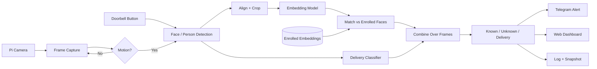

# Offline Smart Doorbell

EC-ENG 535/635 Course Project, Fall 2026, UMass Amherst

Instructor: Prof. Fatima Anwar

Team: Zoya Siddiqui, Vijay Rayavarapu

## Motivation

Most smart doorbells (Ring, Nest, etc.) send video to the cloud to recognize who is at the door. That means footage of your family and visitors is stored on someone else's servers, and the "smart" features stop working if the internet goes down. We want to build a doorbell that does all of the recognition locally on a Raspberry Pi, so nothing leaves the device.

Getting a face recognition model to run on a Pi is not that hard by itself. What we're more interested in is how well it works once you account for the Pi's limits (no GPU, limited memory, overheating under load) and for what a doorbell actually sees. People at a door are often at an angle, wearing hats or masks, or standing in bad lighting, and most of them are strangers the system has never seen. The system has to say "unknown" for those people instead of matching them to the closest household member. Mistaking a stranger for a family member is a much worse error than the reverse, so we care a lot about where we set the matching threshold.

We also want to see what happens when we shrink the models with quantization. Converting a model to INT8 makes it faster and smaller, but it can change the face embeddings slightly, which could mean the threshold we picked for the full model no longer works.

## Design Goals

We set some initial targets, which we'll adjust after we get our first measurements:

- Everything runs offline, with no network calls needed for recognition
- A decision within about half a second of someone showing up
- At least 5 FPS while someone is in front of the camera
- Strangers wrongly recognized as household members less than 1% of the time
- Household members correctly recognized at least 90% of the time
- All models together under 20 MB
- Adding a new person should take 10 photos or fewer and no retraining

## System Blocks

The camera runs continuously, but we only run the models when simple motion detection (comparing consecutive frames) sees something change, or when someone presses the doorbell button. This saves compute and should help with overheating. When triggered, we detect the face, crop and align it, and pass it through an embedding model. We compare the resulting embedding to the stored embeddings of each household member using cosine similarity. If the best match is above our threshold, it's that person; otherwise it's "unknown."

We'll start with the face_recognition library as a baseline, then replace it with smaller TensorFlow Lite models (such as MobileFaceNet) that we can quantize and compare against it.

Rather than deciding from a single frame, we'll combine the results from a few frames in a row, since one blurry frame shouldn't decide the outcome.

For the delivery-person feature, we'll try fine-tuning a small classifier on images of delivery uniforms and packages. We aren't sure how much good training data we'll find for this, so we're treating it as a stretch goal.

## Deliverables

- The full pipeline running offline on the Pi
- A script to enroll new household members
- Known / unknown / delivery-person classification
- Phone notifications, a live web dashboard, and a local log with snapshots
- Results and plots comparing the baseline with the quantized TFLite models
- A live demo and final report

## Hardware Requirements

- Raspberry Pi running Raspberry Pi OS (Bookworm)
- Raspberry Pi Camera Module
- Push button on the GPIO pins as the doorbell
- microSD card and power supply
- Heatsink or fan (we will document the cooling setup since temperature is one of our measurements)

## Software Requirements

- Python 3
- picamera2 (camera)
- RPi.GPIO (doorbell button)
- OpenCV, NumPy, Pillow (image processing)
- face_recognition / dlib (baseline face recognition)
- TensorFlow Lite (lightweight quantized models)
- Google Colab (training and model conversion)
- Flask, Flask-SocketIO, eventlet, gunicorn (live web dashboard)
- Telegram bot API (phone alerts)
- scikit-learn, Matplotlib (evaluation and plots)

## Team Roles

| Role | Team Member |
|---|---|
| Setup | Vijay |
| Software | Zoya |
| Networking | Vijay |
| Algorithm design | Zoya |
| Research | Zoya, Vijay |
| Writing | Zoya, Vijay |

## Timeline

| Dates | Plan | Who |
|---|---|---|
| Oct 3 | Repo and proposal submitted | Both |
| Oct 5 – 16 | Read up on related work, set up the Pi, camera, and button, get the capture loop and motion detection working, plan the test-set collection | Zoya, Vijay |
| Oct 19 – 30 | face_recognition baseline, LFW results, collect our own test set, first version of alerts and dashboard | Zoya, Vijay |
| Nov 2 – 13 | Train and convert TFLite models, run the full pipeline on the Pi, enrollment script, first latency numbers | Zoya, Vijay |
| Nov 16 – 25 | Quantization and model comparison, threshold tuning, enrollment-size tests, delivery classifier | Zoya, Vijay |
| Nov 30 – Dec 6 | Full evaluation, temperature tests, photo spoofing test, plots | Both |
| Dec 7 onward | Demo prep and final report | Both |

We'll adjust these once the check-in dates are announced.

## References

1. Howard et al., "MobileNets: Efficient Convolutional Neural Networks for Mobile Vision Applications," arXiv:1704.04861, 2017.
2. Schroff, Kalenichenko, Philbin, "FaceNet: A Unified Embedding for Face Recognition and Clustering," CVPR 2015.
3. Chen et al., "MobileFaceNets: Efficient CNNs for Accurate Real-Time Face Verification on Mobile Devices," arXiv:1804.07573, 2018.
4. Deng et al., "ArcFace: Additive Angular Margin Loss for Deep Face Recognition," CVPR 2019.
5. Bazarevsky et al., "BlazeFace: Sub-millisecond Neural Face Detection on Mobile GPUs," arXiv:1907.05047, 2019.
6. Jacob et al., "Quantization and Training of Neural Networks for Efficient Integer-Arithmetic-Only Inference," CVPR 2018.
7. Huang et al., "Labeled Faces in the Wild," UMass Amherst Tech Report 07-49, 2007.
8. TensorFlow Lite docs: https://www.tensorflow.org/lite
