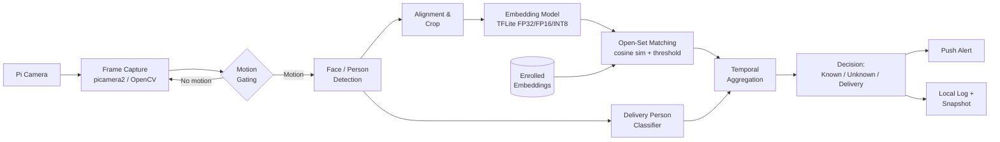

# offline-smart-doorbell
Offline visitor recognition on Raspberry Pi, EC-ENG 635 Fall 2026
# Offline Smart Doorbell: Efficient Open-Set Face Recognition on the Edge

**Course:** EC-ENG 535/635 (Fall 2026), UMass Amherst | **Instructor:** Prof. Fatima Anwar
**Team:** Zoya Siddiqui, Vijay Rayavarapu, Athiniraj Karthigairaj 

---

## 1. Motivation

Commercial smart doorbells offload recognition to the cloud. Video of household members and visitors leaves the home, recognition fails when connectivity drops, and every event pays a network round-trip. Running recognition fully on-device removes these problems but introduces a different one: a Raspberry Pi has no dedicated neural accelerator, a few GB of shared memory, and throttles under sustained load. The question is not whether a face recognizer *can* run on a Pi (it can), but **what accuracy, latency, and reliability are actually achievable under these constraints, and where the bottlenecks are.**

A doorbell is also a harder recognition problem than it first appears:

- **It is open-set.** Most people at the door are strangers who were never enrolled. The system must reject unknowns, not just pick the closest known face. A wrong "known" decision (false accept) is far more costly than a wrong "unknown" (false reject), so the operating point matters more than raw accuracy.
- **Enrollment data is tiny.** Each household member provides only 5–10 photos, typically frontal and well-lit.
- **Doorway conditions differ from benchmarks.** Faces at a door are off-angle, partially occluded (hats, masks, sunglasses), backlit, or captured at night. Standard benchmarks such as LFW are near-saturated and mostly frontal, so benchmark accuracy will overestimate real performance.
- **Compression is not free.** Quantization can shift embedding geometry, which directly moves the decision threshold even when top-1 accuracy looks unchanged.

This project builds a working offline doorbell and uses it to measure these trade-offs systematically.

## 2. Research Questions

**RQ1: Quantization vs. recognition quality.** How much does INT8 post-training quantization of the embedding model degrade open-set verification (TAR at a fixed FAR), and is the degradation uniform across conditions (lighting, pose, occlusion) or concentrated in the hard cases?

**RQ2: System bottlenecks.** Which pipeline stage dominates end-to-end latency on the Pi, and can motion gating keep sustained operation within thermal limits without missing visitors?

**RQ3: Enrollment and calibration.** How many enrollment images per person are needed, and how should the rejection threshold be calibrated so the false accept rate stays low on doorway-condition data rather than only on benchmark data?

## 3. Design Goals

| Goal | Initial Target | Rationale |
|---|---|---|
| Fully offline operation | No network calls in the recognition path | Privacy and robustness to connectivity loss |
| End-to-end latency (person enters frame → decision) | p95 < 500 ms | Decision should arrive before the visitor rings or leaves |
| Throughput while a person is present | ≥ 5 FPS | Enough frames to aggregate decisions over a short window |
| False accept rate on doorway data | ≤ 1% | Strangers must almost never be labeled as household members |
| True accept rate at that FAR | ≥ 90% | Household members should rarely be flagged as unknown |
| Total model footprint | < 20 MB | Leaves memory headroom for capture and buffering |
| Enrollment | ≤ 10 images per person, no retraining | Practical for a real household |

These are hypotheses to test, not guarantees. They will be revised after baseline measurements in Week 3.

## 4. Technical Approach

**Pipeline.** Motion gating (frame differencing) runs cheaply on every frame. Only when motion is detected does the system run face/person detection, then alignment, embedding, and matching. This keeps average compute low and limits thermal load.

**Open-set matching.** Each enrolled person is represented by the mean of their L2-normalized embeddings. A query is accepted as person *k* only if cosine similarity to *k* exceeds a calibrated threshold; otherwise it is labeled unknown. We will compare a single global threshold against per-person thresholds.

**Temporal aggregation.** Instead of deciding from one frame, decisions are aggregated over a short window (e.g., majority vote or mean similarity over N frames). This trades a small amount of latency for robustness to a single bad frame.

**Quantization.** Models are converted to TFLite and evaluated at FP32, FP16, and INT8 (post-training, per-channel, calibrated on a representative set). Beyond accuracy, we measure **embedding drift**: the cosine similarity between FP32 and INT8 embeddings of the same image, which shows whether the threshold needs to be recalibrated after quantization.

**Delivery-person detection.** A small classifier fine-tuned on delivery-uniform and package imagery. Data for this is scarce, so we treat it as a stretch component with a few-shot fine-tuning baseline.

## 5. Evaluation Methodology

**Datasets**
- **LFW** for a standard verification baseline and comparison with published numbers.
- **Doorway test set (collected by the team):** consenting team members and volunteers captured under controlled variation in lighting (day, dusk, artificial light, backlit), pose (frontal, ±30°, ±60°), distance (0.5–2 m), and occlusion (hat, mask, glasses). Non-enrolled volunteers serve as the "stranger" set. This is the primary evaluation set, because LFW will overestimate performance.

**Metrics**
- Verification: ROC curve, TAR @ FAR = 1% and 0.1%, equal error rate (EER)
- Open-set: false accept rate on strangers, false reject rate on enrolled members, broken down by condition
- Detection: recall of face/person detection at doorway distances and angles
- System: per-stage latency (capture, detect, embed, match) at p50 and p95, FPS, peak memory, model size, CPU temperature and throttling under sustained load
- Quantization: accuracy deltas and embedding drift (FP32 vs. INT8 cosine similarity)

**Baselines and Ablations**
- 2–3 backbones (e.g., MobileFaceNet vs. MobileNetV2/V3-based embedders) × 3 precisions (FP32, FP16, INT8)
- Single-frame vs. temporally aggregated decisions
- Global vs. per-person thresholds
- 1, 3, 5, and 10 enrollment images per person
- With vs. without motion gating (latency, temperature, missed visitors)

## 6. Deliverables

1. Working offline pipeline on Raspberry Pi: capture → motion gating → detection → alignment → embedding → open-set matching → decision.
2. Enrollment tool that registers a new household member from ≤ 10 photos without retraining.
3. Three visitor classes: Known / Unknown / Delivery person.
4. Alert mechanism (push notification) and local log with timestamped snapshots.
5. Quantization and backbone study answering RQ1, with accuracy-vs-latency trade-off plots.
6. Latency breakdown and thermal analysis answering RQ2.
7. Enrollment-size and threshold calibration analysis answering RQ3.
8. Live demonstration on the device and a final report.

## 7. System Blocks



## 8. Hardware / Software Requirements

**Hardware**
- Raspberry Pi 4 (4 GB+) or Raspberry Pi 5
- Raspberry Pi Camera Module (or USB webcam)
- 32 GB+ microSD, official power supply, heatsink/fan (thermal behavior is part of the evaluation, so cooling must be documented)
- Optional: USB power meter for energy measurements

**Software**
- Raspberry Pi OS (64-bit), Python 3.11
- Inference: TensorFlow Lite runtime; ONNX Runtime as an alternative backend
- Vision: OpenCV, picamera2
- Training and conversion: Google Colab, TensorFlow/Keras or PyTorch
- Alerts: Telegram bot API or ntfy
- Evaluation: NumPy, scikit-learn (ROC/EER), Matplotlib
- Version control: Git/GitHub

## 9. Risks and Mitigations

| Risk | Impact | Mitigation |
|---|---|---|
| INT8 quantization shifts embeddings and breaks the threshold | Higher false accepts | Measure embedding drift; recalibrate threshold per precision; fall back to FP16 if loss is too large |
| Pi throttles under sustained inference | Latency spikes, missed frames | Motion gating, active cooling, report throttled vs. unthrottled numbers |
| Poor accuracy at night or backlit | Real-world failure | Include these conditions in the test set; evaluate histogram equalization / CLAHE preprocessing |
| Too little delivery-person data | Weak classifier | Treat as stretch goal; few-shot fine-tuning; report honestly if unreliable |
| Small stranger set inflates confidence in FAR | Misleading results | Report confidence intervals; supplement strangers with LFW identities |

## 10. Limitations and Ethical Considerations

- **Spoofing:** The system does not include liveness detection, so a printed photo of a household member may be accepted. We will test a simple print attack and report the result as a known limitation rather than claim security.
- **Demographic performance:** Face recognition accuracy can vary across demographic groups. Our test set is small and not representative, so we will avoid general claims and note this explicitly.
- **Consent and data handling:** Only consenting participants are photographed. Face images and embeddings stay on-device and are excluded from this repository via `.gitignore`.

## 11. Team Members and Responsibilities

| Lead Role | Lead | Support |
|---|---|---|
| Setup (Pi, camera, OS, cooling, environment) | Vijay | Athinraj |
| Software (pipeline, integration, enrollment tool) | Vijay | Zoya |
| Networking (alerts, notifications, logging) | Athinraj | Vijay |
| Algorithm Design (models, matching, calibration, quantization) | Zoya | Athinraj |
| Research (literature, evaluation design, analysis) | Zoya | Athinraj |
| Writing (documentation, check-ins, final report) | Athinraj | Zoya, Vijay |

- **Zoya Siddiqui:** Model selection, training and conversion, open-set matching and threshold calibration, quantization study, and evaluation design (RQ1, RQ3). Prior experience in PyTorch model training, YOLO detection validation, and GPU benchmarking.
- **Vijay [Last Name]:** Raspberry Pi setup, capture pipeline with motion gating, on-device integration, enrollment tool, and latency/thermal profiling (RQ2).
- **Athinraj [Last Name]:** Alert and logging system, doorway test-set collection protocol, delivery-person classifier support, and coordination of documentation and the final report.

## 12. Project Timeline

| Dates | Milestone | Owner |
|---|---|---|
| Oct 3 | Repository and proposal submitted | All |
| Oct 5 – Oct 16 | Literature review; Pi + camera setup; capture loop with motion gating; design test-set collection protocol | Zoya (research), Vijay (setup), Athinraj (protocol) |
| Oct 19 – Oct 30 | Baseline detection + embedding on Colab; LFW verification baseline; collect doorway test set; alert prototype | Zoya (models), Athinraj (data, alerts), Vijay (capture support) |
| Nov 2 – Nov 13 | TFLite conversion; full pipeline on Pi; enrollment tool; first per-stage latency breakdown | Vijay (deploy), Zoya (conversion) |
| Nov 16 – Nov 25 | Quantization and backbone study; threshold calibration; enrollment-size ablation; delivery classifier | Zoya (RQ1, RQ3), Vijay (RQ2 profiling), Athinraj (delivery classifier) |
| Nov 30 – Dec 6 | End-to-end evaluation on doorway set; thermal analysis; spoofing test; plots | All |
| Dec 7 – final deadline | Demo preparation, final report, repository cleanup | Athinraj (report lead), All |

Dates will be aligned with course check-ins once announced.

## 13. Repository Structure (planned)

```
offline-smart-doorbell/
├── README.md
├── docs/            # proposal, check-in notes, final report, figures
├── notebooks/       # Colab training, conversion, and analysis notebooks
├── models/          # exported .tflite models (small ones only)
├── src/
│   ├── capture.py   # camera loop + motion gating
│   ├── detect.py    # face/person detection
│   ├── embed.py     # embedding inference
│   ├── match.py     # enrolled database, open-set matching, aggregation
│   ├── enroll.py    # add household members
│   └── alert.py     # notifications + logging
├── benchmarks/      # latency, thermal, and accuracy scripts and results
└── requirements.txt
```

## 14. References

1. A. G. Howard et al., "MobileNets: Efficient Convolutional Neural Networks for Mobile Vision Applications," arXiv:1704.04861, 2017.
2. F. Schroff, D. Kalenichenko, J. Philbin, "FaceNet: A Unified Embedding for Face Recognition and Clustering," CVPR 2015 (arXiv:1503.03832).
3. S. Chen et al., "MobileFaceNets: Efficient CNNs for Accurate Real-Time Face Verification on Mobile Devices," arXiv:1804.07573, 2018.
4. J. Deng et al., "ArcFace: Additive Angular Margin Loss for Deep Face Recognition," CVPR 2019 (arXiv:1801.07698).
5. V. Bazarevsky et al., "BlazeFace: Sub-millisecond Neural Face Detection on Mobile GPUs," arXiv:1907.05047, 2019.
6. B. Jacob et al., "Quantization and Training of Neural Networks for Efficient Integer-Arithmetic-Only Inference," CVPR 2018 (arXiv:1712.05877).
7. G. B. Huang et al., "Labeled Faces in the Wild: A Database for Studying Face Recognition in Unconstrained Environments," UMass Amherst Tech Report 07-49, 2007.
8. TensorFlow Lite documentation: https://www.tensorflow.org/lite
